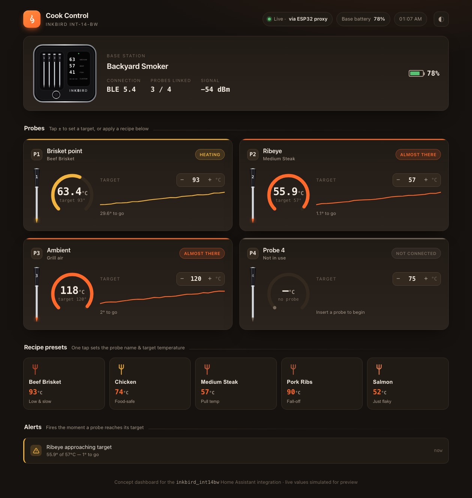

# Inkbird INT-14-BW for Home Assistant

A custom [Home Assistant](https://www.home-assistant.io/) integration for the
**Inkbird INT-14-BW** (also sold as the **IBT-4XS**) 4-probe Bluetooth meat
thermometer. It connects to the thermometer over Bluetooth Low Energy, performs
the device's authentication handshake, and exposes all four probes plus the
battery level as native Home Assistant sensors — **no cloud, no MQTT bridge, no
custom firmware required.**

> Works with a Bluetooth adapter on your Home Assistant machine **or** with an
> [ESPHome Bluetooth proxy](https://esphome.io/components/bluetooth_proxy.html)
> for extra range — the integration uses Home Assistant's built-in Bluetooth
> stack, so it automatically uses whichever path can reach your thermometer.

An optional ready-made **Cook Control dashboard** is included ([`dashboard/`](dashboard/)):



> [!IMPORTANT]
> **The Inkbird phone app and this integration cannot both be connected at
> once — this works in both directions.** A Bluetooth LE thermometer accepts
> only one connection at a time. While the Inkbird app is connected (even in
> the background), Home Assistant cannot connect; and while Home Assistant is
> connected, the Inkbird app will not. **Fully close the Inkbird app** (swipe
> it away, don't just background it) for the integration to work, and expect to
> lose the integration's connection whenever you open the app.

| Entity | Description |
|---|---|
| `sensor.int_14_bw_probe_1` … `probe_4` | Tip temperature of each probe |
| `sensor.int_14_bw_probe_1_ambient` … | Ambient (grill/oven air) temperature per probe — **disabled by default**, enable per probe when smoking/grilling |
| `sensor.int_14_bw_battery` | Base-station battery level (%) |

Sensors update in real time (roughly every few seconds) while the thermometer
is on and in range, and switch to **unavailable** when it is powered off or out
of range.

A probe that is **sitting in the base station charging** reports no reading —
only probes actually pulled out and in use show a temperature. (The integration
reads the device's per-probe dock state to tell the difference.)

### Temperature unit (°C / °F)

Probe temperatures are read from the device in °C. Open the integration's
**Configure** button (Settings → Devices & Services → Inkbird INT-14-BW →
Configure) to choose:

- **Follow Home Assistant** (default) — keep °C and let Home Assistant convert
  to your unit system for display; per-entity overrides still work.
- **Celsius** / **Fahrenheit** — force a specific unit on the probe sensors.

### Want a dashboard?

A ready-made "Cook Control" dashboard — radial probe gauges, editable targets,
recipe presets, a °C/°F toggle, and ready-alerts — lives in
[`dashboard/`](dashboard/). See [dashboard/README.md](dashboard/README.md).

---

## Requirements

You need **one** of the following so Home Assistant can reach the thermometer
over Bluetooth:

1. **A local Bluetooth adapter** on the machine running Home Assistant
   (most mini-PCs, a Raspberry Pi's built-in radio, or a USB Bluetooth dongle).
   Make sure the built-in
   [Bluetooth integration](https://www.home-assistant.io/integrations/bluetooth/)
   is set up and working.

2. **An ESP32 running the ESPHome Bluetooth Proxy.** This is the recommended
   option if your Home Assistant server is far from where you cook. A cheap
   ESP32 board flashed with the ready-made proxy firmware relays BLE traffic
   over Wi-Fi. See the [setup guide below](#option-b-esp32-bluetooth-proxy).

---

## Installation

### HACS (recommended)

1. Make sure [HACS](https://hacs.xyz/) is installed.
2. In HACS, open the three-dot menu → **Custom repositories**.
3. Add `https://github.com/boris327/ha-inkbird-int14bw` with category
   **Integration**.
4. Search for **Inkbird INT-14-BW** in HACS and click **Download**.
5. **Restart Home Assistant.**

[](https://my.home-assistant.io/redirect/hacs_repository/?owner=boris327&repository=ha-inkbird-int14bw&category=integration)

### Manual

1. Download the latest release.
2. Copy the `custom_components/inkbird_int14bw` folder into your Home Assistant
   `config/custom_components/` directory, so you end up with
   `config/custom_components/inkbird_int14bw/`.
3. **Restart Home Assistant.**

---

## Configuration

1. Find your thermometer's Bluetooth MAC address. Open the **Inkbird app** and
   go to **Settings → Device Information** — the Bluetooth MAC is listed there
   (it looks like `A4:C1:38:XX:XX:XX`).

   > **Important:** close the Inkbird app afterwards. Bluetooth LE devices can
   > only talk to one client at a time, so while the phone app is connected,
   > Home Assistant cannot connect.

2. In Home Assistant, go to **Settings → Devices & Services → Add Integration**
   and search for **Inkbird INT-14-BW**.

   > If Home Assistant has already seen your thermometer advertising nearby, it
   > may be **discovered automatically** and appear as a ready-to-configure
   > device — in that case you can skip typing the MAC entirely.

3. Enter the MAC address from step 1 and submit.

4. The device and its five sensors (4 probes + battery) are created
   automatically.

---

## Option B: ESP32 Bluetooth proxy

If your Home Assistant server doesn't have Bluetooth, or is too far from the
grill, use a cheap ESP32 as a Bluetooth proxy. This is a fully supported,
first-class path — the integration doesn't care whether the device is reached
locally or via a proxy.

1. Get any ESP32 dev board.
2. Install [ESPHome](https://esphome.io/) (the Home Assistant add-on is the
   easiest route).
3. Flash the board with the official Bluetooth Proxy firmware from
   <https://esphome.io/projects/?type=bluetooth> — it's a guided, in-browser
   flash, no coding required.
4. Adopt the ESP32 in ESPHome / Home Assistant. Once it's online, the Inkbird
   integration will transparently connect through it.

Keep the ESP32 within Bluetooth range of the thermometer (same room / a few
metres). Home Assistant automatically picks the proxy or a local adapter,
whichever has the better signal.

---

## Troubleshooting

**Sensors show "unavailable".**
- Make sure the thermometer is powered on and a probe is connected — the base
  station stops advertising over Bluetooth when idle to save battery.
- Make sure the **Inkbird phone app is closed**. It holds the single BLE
  connection the device allows.
- Confirm the thermometer is within range of a Bluetooth adapter or ESP32
  proxy. Move it closer to test.

**The device isn't discovered / connection keeps dropping.**
- Only one Bluetooth client can connect at a time. If you also ran an older
  MQTT bridge or ESP32 gateway pointed at the same thermometer, turn it off —
  two clients fighting over the device cause exactly this.
- Check **Settings → Devices & Services → Bluetooth** to confirm your adapter
  or proxy is healthy and actively scanning.

**Probe reads a strange value (e.g. blank / no reading).**
- A probe that isn't plugged in reports no reading and the sensor stays empty.
  This is expected.

To gather logs for a bug report, add this to `configuration.yaml` and restart:

```yaml
logger:
  default: warning
  logs:
    custom_components.inkbird_int14bw: debug
```

---

## How it works

The INT-14-BW speaks BLE GATT on vendor service `0xff00`. Temperature telemetry
arrives as notifications on characteristic `ff01`; the device requires a
per-session challenge/response authentication over `ff02` (a two-stage CRC-8
chain over a timestamp and the challenge) or it silently disconnects after
~30 seconds.

The protocol was reverse-engineered from the official Inkbird Android app; huge
thanks to [paul43210/inkbird-bw-ble](https://github.com/paul43210/inkbird-bw-ble)
for documenting the INT-12-BW / INT-14-BW family and the authentication
algorithm. The 4-probe telemetry byte layout was confirmed on real hardware.

---

## Disclaimer

This is an unofficial, community-built integration. It is not affiliated with or
endorsed by Inkbird. "Inkbird" and product names are trademarks of their
respective owners.

## License

[MIT](LICENSE)
